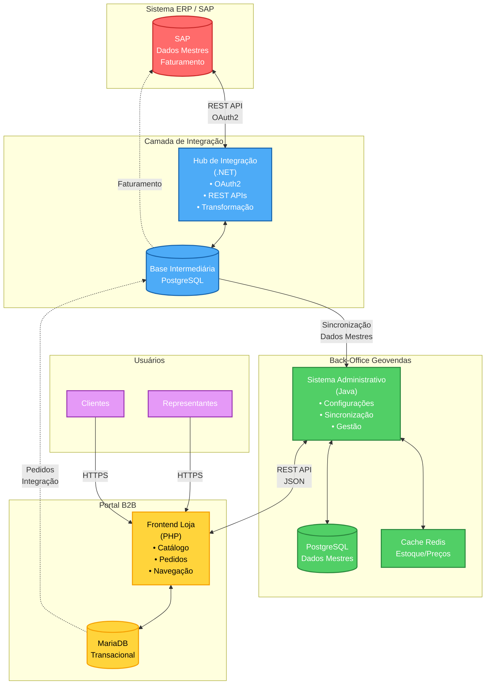

## T-01 - Arquitetura de Desacoplamento do SAP

### Pergunta
Descreva em detalhes a arquitetura de solução proposta para resolver o desacoplamento do SAP, garantindo que o SAP seja (no futuro) apenas o faturador. Como sua plataforma irá gerenciar dados mestres (Cliente, Produto, Preço) e transacionais (Estoque, Pedido) em tempo real?

### Resposta

A solução Geovendas foi projetada desde sua concepção para operar de forma desacoplada do sistema ERP, utilizando múltiplas camadas de abstração que permitem ao SAP funcionar exclusivamente como sistema de faturamento, enquanto toda a gestão de dados mestres e transacionais é realizada por componentes especializados da plataforma.

#### Arquitetura de Camadas e Desacoplamento

O desacoplamento do SAP é alcançado através de uma arquitetura distribuída em três camadas principais. A primeira camada consiste em um componente de integração especializado que atua como ponte entre o ERP e os sistemas Geovendas. Este componente é responsável por extrair dados do SAP através de APIs REST utilizando autenticação baseada em tokens, garantindo comunicação segura e padronizada. A extração de dados não interfere nas operações do ERP e ocorre de forma assíncrona, minimizando impacto na performance dos sistemas corporativos.

Uma vez extraídos, os dados passam por um processo de transformação e normalização antes de serem armazenados em uma base de dados intermediária. Esta base de dados intermediária é crucial para o desacoplamento, pois permite que os sistemas Geovendas operem de forma completamente independente do SAP. Mesmo que o ERP esteja indisponível temporariamente, toda a operação de vendas B2B pode continuar normalmente, utilizando os dados já sincronizados. Este modelo arquitetural garante alta disponibilidade e resiliência operacional.

#### Gerenciamento de Dados Mestres

O gerenciamento de dados mestres (Cliente, Produto, Preço) é realizado através de um sistema próprio de back-office que funciona como o hub central de configurações e sincronizações. Este sistema mantém réplicas atualizadas de todos os dados mestres necessários para a operação comercial, incluindo cadastros completos de clientes com suas condições comerciais, catálogo de produtos com todas as variações e atributos, tabelas de preços diferenciadas por cliente ou grupo comercial, políticas comerciais e regras de negócio específicas.

A sincronização de dados mestres ocorre de forma bidirecional quando necessário. Novos clientes criados no portal B2B podem ser enviados para aprovação no back-office e posteriormente integrados ao ERP. Alterações de dados mestres originadas no SAP são capturadas pela camada de integração e propagadas para os sistemas Geovendas através de processos de sincronização que podem operar em modo real-time ou em lotes agendados, dependendo da natureza da informação e dos requisitos de negócio.

O sistema de back-office também permite que administradores e gestores realizem ajustes e configurações específicas que não existem no ERP, como regras de visualização de produtos por perfil de cliente, campanhas promocionais exclusivas do canal digital, condições de pagamento diferenciadas para o ambiente B2B, e limites de crédito dinâmicos que podem ser mais flexíveis que as regras tradicionais do ERP.

#### Gerenciamento de Dados Transacionais em Tempo Real

Para dados transacionais críticos como estoque e pedidos, a arquitetura implementa mecanismos específicos de sincronização em tempo real. O estoque disponível para venda é mantido em cache distribuído utilizando tecnologia de memória de alta performance, permitindo consultas extremamente rápidas durante a navegação dos clientes no portal. As atualizações de estoque provenientes do ERP são processadas continuamente pela camada de integração e propagadas imediatamente para o cache, garantindo que os representantes e clientes visualizem sempre informações atualizadas.

O processo de gestão de pedidos implementa um fluxo sofisticado que garante integridade e rastreabilidade. Quando um pedido é criado no portal B2B, ele passa por validações locais que verificam políticas comerciais, disponibilidade de estoque, limites de crédito e regras de negócio específicas do cliente. Após aprovação local, o pedido é registrado no banco de dados da plataforma Geovendas e entra em uma fila de integração para ser transmitido ao SAP.

A transmissão de pedidos para o ERP ocorre através de APIs REST com confirmação de recebimento e processamento. O sistema implementa mecanismos de retry inteligentes para lidar com indisponibilidades temporárias do ERP, garantindo que nenhum pedido seja perdido. Cada pedido possui estados bem definidos que permitem rastreamento completo desde a criação até o faturamento no SAP. Estados como "pendente de integração", "enviado ao ERP", "aguardando aprovação", "em processamento", "faturado" e "concluído" proporcionam visibilidade total do ciclo de vida do pedido.

#### Sincronização Bidirecional e Governança de Dados

A arquitetura suporta sincronização bidirecional inteligente, onde atualizações podem ocorrer tanto nos sistemas Geovendas quanto no SAP, com mecanismos de resolução de conflitos baseados em regras de negócio pré-estabelecidas. Por exemplo, se um pedido é modificado no back-office da plataforma mas ainda não foi faturado no SAP, a alteração pode ser propagada para o ERP. Entretanto, uma vez que o pedido entra em processo de faturamento no SAP, ele se torna imutável na plataforma Geovendas, garantindo consistência e integridade.

O sistema mantém logs detalhados de todas as sincronizações, permitindo auditoria completa e troubleshooting em caso de inconsistências. Dashboards administrativos fornecem visibilidade em tempo real do status das integrações, volumes de dados sincronizados, latências de comunicação e eventuais erros que necessitem intervenção manual.

#### Preparação para SAP como Faturador Exclusivo

A arquitetura atual já prepara o terreno para que o SAP atue exclusivamente como faturador. Todos os processos de gestão comercial, configuração de políticas, gestão de catálogo, relacionamento com clientes e captura de pedidos ocorrem completamente fora do ERP. O SAP recebe apenas os pedidos já validados e aprovados, pronto para executar o processo de faturamento. Esta separação clara de responsabilidades permite que, no futuro, o faturamento possa até mesmo ser migrado para outra solução sem impactar a operação comercial digital, pois a camada de integração pode ser facilmente adaptada para comunicar com diferentes sistemas de faturamento.

## Diagrama de Arquitetura

### Legenda do Diagrama

**Componentes Principais:**
- **ERP/SAP**: Sistema origem dos dados mestres, executa faturamento
- **Hub de Integração**: Camada intermediária que extrai dados do SAP via API e normaliza
- **Base Intermediária**: PostgreSQL que armazena dados sincronizados do ERP
- **Back-Office**: Sistema administrativo para configurações e gestão de dados mestres
- **Cache Redis**: Armazenamento em memória para estoque e preços (performance)
- **Portal B2B**: Frontend da loja onde representantes e clientes navegam e criam pedidos

**Fluxo de Dados:**
1. **SAP → Hub**: Extração de dados mestres via REST API com OAuth2
2. **Hub → Back-Office**: Sincronização de catálogo, clientes, preços
3. **Back-Office → Cache**: Otimização de consultas de estoque/preços
4. **Back-Office ↔ Portal B2B**: APIs REST para operações de leitura/escrita
5. **Portal B2B → SAP**: Pedidos são integrados via camada de integração para faturamento

**Segurança:**
- Comunicação HTTPS entre usuários e portal
- OAuth2 para integração com SAP
- Isolamento de bases de dados por função
- Perfis de acesso granulares em todas as camadas